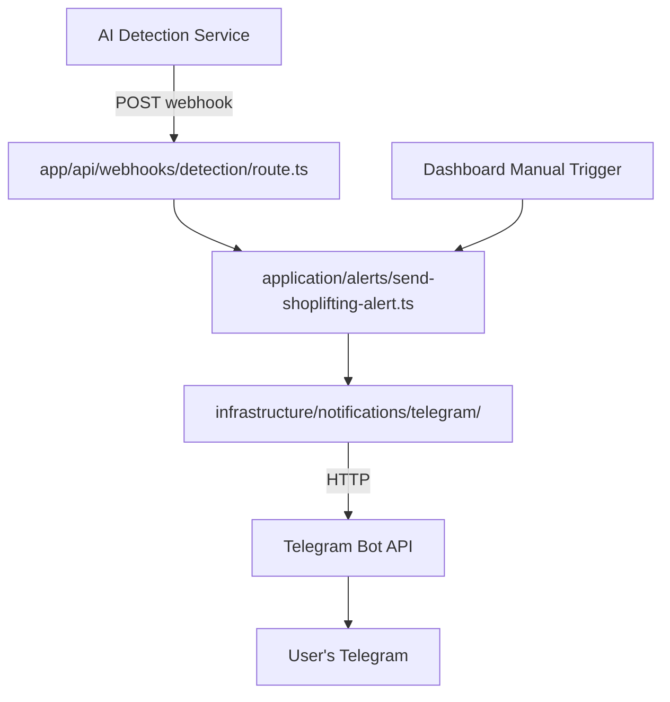

# Telegram Bot Push Notifications Implementation

## Architecture Overview




## Layer Structure

Following your clean architecture rules, the implementation will be organized as:

- **Infrastructure Layer**: Telegram Bot API client
- **Application Layer**: Use case for sending alerts
- **Presentation Layer**: Webhook endpoint + optional dashboard trigger
- **Core Layer**: Domain types for alerts

## Implementation Steps

### 1. Install Dependencies

Add `neverthrow` for Result types (required by architecture):

```bash
pnpm add neverthrow
```


### 2. Core Layer - Domain Types

Create [`core/types/alert/shoplifting-alert.ts`](core/types/alert/shoplifting-alert.ts):

- Define `ShopliftingAlert` type
- Define `AlertSeverity` enum
- Define `CameraInfo` type

### 3. Infrastructure Layer - Telegram Client

Create [`infrastructure/notifications/telegram/telegram-client.ts`](infrastructure/notifications/telegram/telegram-client.ts):

- Implement `sendTelegramMessage()` returning `Result<void, Error>`
- Implement `sendTelegramPhoto()` for image attachments
- Handle rate limiting with retry logic
- Add timeout handling (30s default)
- Format messages with HTML parse mode

Create [`infrastructure/notifications/telegram/format-alert-message.ts`](infrastructure/notifications/telegram/format-alert-message.ts):

- Format alert into HTML message with emojis
- Include camera info, timestamp, confidence level
- Make message clear and actionable

### 4. Application Layer - Use Case

Create [`application/dto-types/alert-dto.ts`](application/dto-types/alert-dto.ts):

- Define `ShopliftingAlertDTO` (serializable version)
- All dates as ISO strings

Create [`application/alerts/send-shoplifting-alert.ts`](application/alerts/send-shoplifting-alert.ts):

- Server action marked with `'use server'`
- Takes `ShopliftingAlertDTO` as input
- Returns `ResponseWrapper<void>`
- Validates environment variables
- Calls infrastructure layer
- Handles errors gracefully

### 5. Presentation Layer - Webhook Endpoint

Create [`app/api/webhooks/detection/route.ts`](app/api/webhooks/detection/route.ts):

- POST endpoint for AI service
- Verify webhook secret via `x-api-key` header
- Parse incoming JSON payload
- Transform to DTO format
- Call application layer
- Return proper HTTP status codes

### 6. Environment Configuration

Add to [`.env.local`](.env.local):

```env
TELEGRAM_BOT_TOKEN=your_bot_token_here
TELEGRAM_CHAT_ID=your_chat_id_here
WEBHOOK_SECRET=generate_random_secret
```


### 7. Shared Types

Create [`types/response-wrapper.ts`](types/response-wrapper.ts) if not exists:

- Define `ResponseWrapper<T>` type for application layer

Create [`lib/errors.ts`](lib/errors.ts):

- Helper function `unknownToError()` for error handling

## Key Features

### Robustness Features

1. **Retry Logic**: Automatic retry with exponential backoff (3 attempts)
2. **Timeout Handling**: 30-second timeout for Telegram API calls
3. **Rate Limiting**: Respect Telegram's rate limits
4. **Error Handling**: Comprehensive error messages with Result types
5. **Validation**: Input validation for all DTOs
6. **Security**: Webhook authentication with secret key
7. **Logging**: Structured error logging for debugging

### Message Format

Alerts will include:

- Detection timestamp
- Camera ID and name
- Confidence percentage
- Snapshot image (if provided)
- Clear action required message

## Testing Strategy

Manual testing approach:

1. Test webhook with curl/Postman
2. Verify Telegram message delivery
3. Test error scenarios (invalid token, network failure)
4. Verify retry logic works

## Files to Create

Core Layer:

- `core/types/alert/shoplifting-alert.ts`

Infrastructure Layer:

- `infrastructure/notifications/telegram/telegram-client.ts`
- `infrastructure/notifications/telegram/format-alert-message.ts`

Application Layer:

- `application/dto-types/alert-dto.ts`
- `application/alerts/send-shoplifting-alert.ts`

Presentation Layer:

- `app/api/webhooks/detection/route.ts`

Shared:

- `types/response-wrapper.ts`
- `lib/errors.ts`

Configuration:

- `.env.local` (update with your tokens)